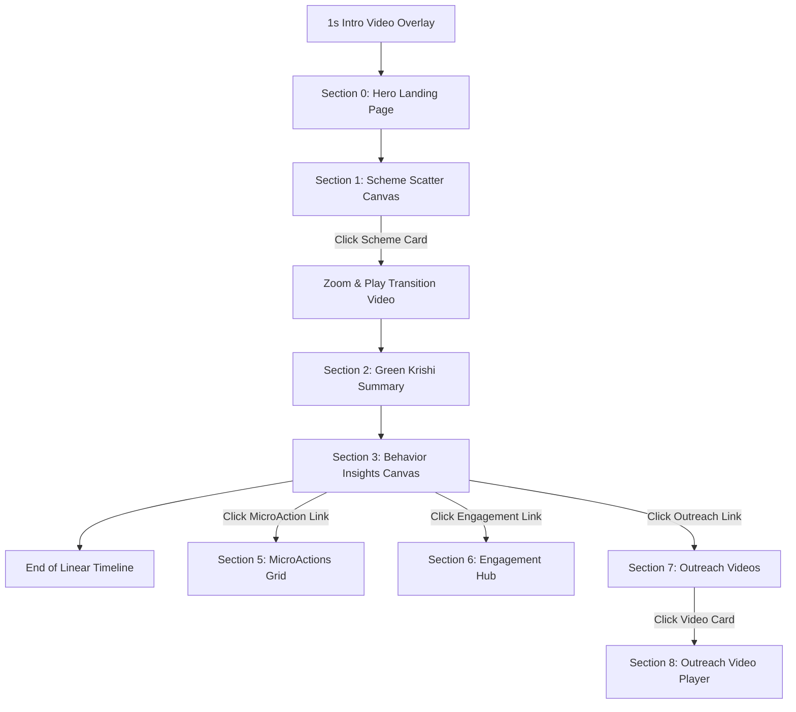

# Bank of Baroda — Green Krishi Behaviour Intelligence Platform

An immersive, highly interactive, and responsive web application built with **React**, **TypeScript**, and **Vite** designed to present the Bank of Baroda's Green Krishi Behaviour Intelligence framework. The platform guides users through behavioral trends, loan schemes, agricultural micro-actions, outreach, and customer engagement models using a fluid, single-page horizontally sliding timeline interface.

---

## 🌟 Visual Design Philosophy

The project is built around a warm, premium, enterprise-focused palette:
- **Primary Background**: Radial gradients shifting between a clean warm-white (`#F8F8F6`), faint accent orange, and environmental green (`rgba(46, 158, 91, 0.05)`).
- **Accent Orange (`#eb6525`)**: Representing energy, bank identity, and critical CTA highlights.
- **Accent Green (`#2e9e5b`)**: Representing sustainability, growth, and agricultural development.
- **Glassmorphism**: Soft backdrop blur filters (`backdrop-filter: blur(8px)`) with light semi-transparent borders for high-depth card layers.
- **Fluid Typography**: Dynamic scaling via CSS `clamp()` ensuring headings, descriptions, and labels scale fluidly from small mobile displays to 4K monitors.

---

## 🧭 Page Architecture & Component Tour

The user travels through a **horizontal scroll canvas** consisting of linear timeline stages and conditional "Hub" branches.



### 1. Intro Video Splash (`HeroIntro.tsx`)
- **What it is**: A high-impact splash screen that overlay-plays an intro video (`bankvideo.mp4`) as soon as the site is loaded.
- **Behavior**: Displays the title and agricultural sub-copy. The video plays for exactly **1 second** before triggering a smooth 800ms fade-out transition to reveal the Hero section.
- **Optimizations**: Optimized for mobile and iOS Safari by using `muted playsInline preload="metadata"` to prevent cellular bandwidth pre-throttling.

### 2. The Hero Section (`Hero.tsx`)
- **Left Column**: Fluidly scaling headings, dynamic primary button overlays, and an intro entry stagger animation sequence.
- **Right Column (`HeroCards`)**: Immersive dashboard summary cards that fade and slide in simultaneously when the intro overlay finishes.

### 3. Scheme Scatter Canvas (`Schemes.tsx`)
- **Design**: An organic scatter map of available loan products floating dynamically behind a central heading.
- **Parallax Physics**: Includes mouse hover coordinate tracking (`useRef` coordinate listener) mapped to a requestAnimationFrame animation loop to gently skew the canvas container (`transform: translate3d(...)`) with realistic momentum.
- **Individual Floating**: CSS variable-injected keyframes (`--s2-float-x`, `--s2-float-y`) make each card breathe individually.

### 4. Transition & Green Krishi Summary (`GreenKrishi.tsx`)
- **Immersive Zoom**: When a user clicks a scheme card, the UI instantly shifts to Section 2. A custom zoom overlay expands the clicked card, fades in the background video, and smoothly cross-fades into the Green Krishi summary.

### 5. Behavior Insights (`BehaviorCards.tsx`)
- Provides deep agricultural behavior insights, dividing borrowers by category and serving as the primary launchpad for the **Hub Branches**.

### 6. Gated Hub Sections
- **Micro Actions (`MicroActions.tsx`)**: Fullscreen responsive view mapping behavioral targets to operational steps.
- **Engagement Hub (`EngagementHub.tsx`)**: Implements tabbed navigation panels, key check-items, and strategic indicators.
- **Outreach Canvas & Video Player (`Outreach.tsx` / `OutreachVideoHub.tsx`)**: Visual collection of educational campaigns and integrated video playback.

---

## 🛠️ The Navigation Engine (`useSectionNavigation.ts`)

A centralized navigation controller manages the entire scroll experience. It listens to keyboard arrows, touch events, and mouse scroll wheels to map scroll intents to strict coordinate offsets.

### The Gatekeeper Model
To protect the narrative structure of the presentation, the "Hub" pages (Sections 5–8) are **gated**. Users cannot scroll into them by accident. 
1. The navigation state maintains `hubAccessGrantedRef` (can be `"none"`, `"microactions"`, `"engagement"`, `"outreach"`, or `"outreachvideo"`).
2. If the user scrolls into a section index that is part of `HUB_SECTIONS` without matching authorizations, the hook automatically intercepts the scroll, triggers a smooth snap transition back to the main timeline (index 4), and clears layout states.

---

## 💥 Challenges Faced & Engineering Solutions

### Bug 1: The GreenKrishi Snap-Back Error
* **The Symptom**: After clicking a scheme card (initiating the zoom transition), the viewport scrolled correctly, but subsequent scroll attempts to go to the Behavior Cards would glitch, snap backward, or jump to the Hero page.
* **The Cause**: The scheme card click used `el.scrollLeft = 2 * window.innerWidth` to instantly place the scrollbar at Section 2. However, this bypassed the React state updates inside the custom navigation hook. The hook's internal `targetSectionRef.current` remained stuck at `1` (Schemes). The scroll event handler compared the actual position (index 2) against the stale target (index 1), triggering an immediate correction.
* **The Solution**: Destructured `targetSectionRef` from the custom navigation hook and synchronized it directly during the instant click transition (`targetSectionRef.current = 2`).

### Bug 2: Stale Closures on Hub Navigation (Micro Actions Scroll Crash)
* **The Symptom**: Clicking the "Micro Action" button in the Behavior section would scroll the page all the way back to the Hero landing page (index 0).
* **The Cause**: The scroll controller calculated scroll offsets by counting the width of visible sections dynamically using a `collapsedIndices` set. The scroll handler callback was bound to React state via `useCallback` dependency arrays. When navigating from Section 4 to Section 5, it captured a stale version of the `collapsedIndices` set (which still contained `{5, 6}` from a prior transition). This forced the math to offset index 5 to `0 * window.innerWidth`, targeting the Hero section.
* **The Solution**: Rewrote adjacent navigation transitions. Since sections immediately adjacent to each other (e.g., 4 to 5, or 7 to 8) never have intermediate collapsed pages between them, we bypass the dynamic collapsed count helper and scroll directly to `index * window.innerWidth`. This decoupled the target calculation from stale state hooks.

### Bug 3: Touch Scrolling Bypassing the Authorization Gates on Mobile
* **The Symptom**: On desktops, scroll wheels were intercepted and checked by the hub gate logic. On touch screens, mobile swiping used browser-native scroll-snap which scrolled directly into gated hubs (Engagement, Outreach) without requiring button clicks.
* **The Cause**: The scroll-snap container relied on wheel event listeners for gatekeeper checks. Swipes do not trigger wheel events, and the default `scroll` listener only fires after scroll settlements, allowing users to scroll past the gates mid-swipe.
* **The Solution**: Added custom touch listeners (`touchstart`, `touchmove`, and `touchend`) directly into the scroll canvas:
  - `touchstart` records client touch origins.
  - `touchmove` calculates horizontal vs vertical offsets. If a horizontal swipe exceeds 6px, it triggers `e.preventDefault()`, taking manual control away from the native browser scroll-snap.
  - `touchend` detects swipe directions, filters out minor vibrations (requires a 30px swipe), matches directions to scroll targets, checks permissions, and triggers safe animations via `scrollToSection()`.

### Bug 4: Horizontal Screen Clipping and Grid Overflow
* **The Symptom**: On small screens and mobile devices (widths ≤ 760px), cards and panels broke out of their sections, causing clipping and secondary vertical/horizontal scrollbars.
* **The Cause**: Styles like `grid-template-columns: minmax(300px, 0.78fr) minmax(460px, 1.22fr)` forced a minimum width of 760px even when screen viewports were 375px wide.
* **The Solution**: Replaced layout constraints with fluid media query breakpoints:
  - Converted two-column side-by-side grids into single column layouts on screens under 768px.
  - Enforced `min-width: 0` on responsive child containers so flex containers can shrink correctly.
  - Implemented CSS safe-area helper offsets (`env(safe-area-inset-top)`) to adjust button placement dynamically on notched mobile screens.

---

## 🚀 Running & Building Locally

### Setup
Ensure dependencies are installed:
```bash
npm install
```

### Development Server
Run the local Vite dev server with Hot Module Replacement (HMR):
```bash
npm run dev
```

### Production Build
Compile TypeScript and generate the optimized static build folder (`dist`):
```bash
npm run build
```

---

*Note: This repository is fully pre-configured for Vercel deployment with routing overrides defined in `vercel.json`.*
